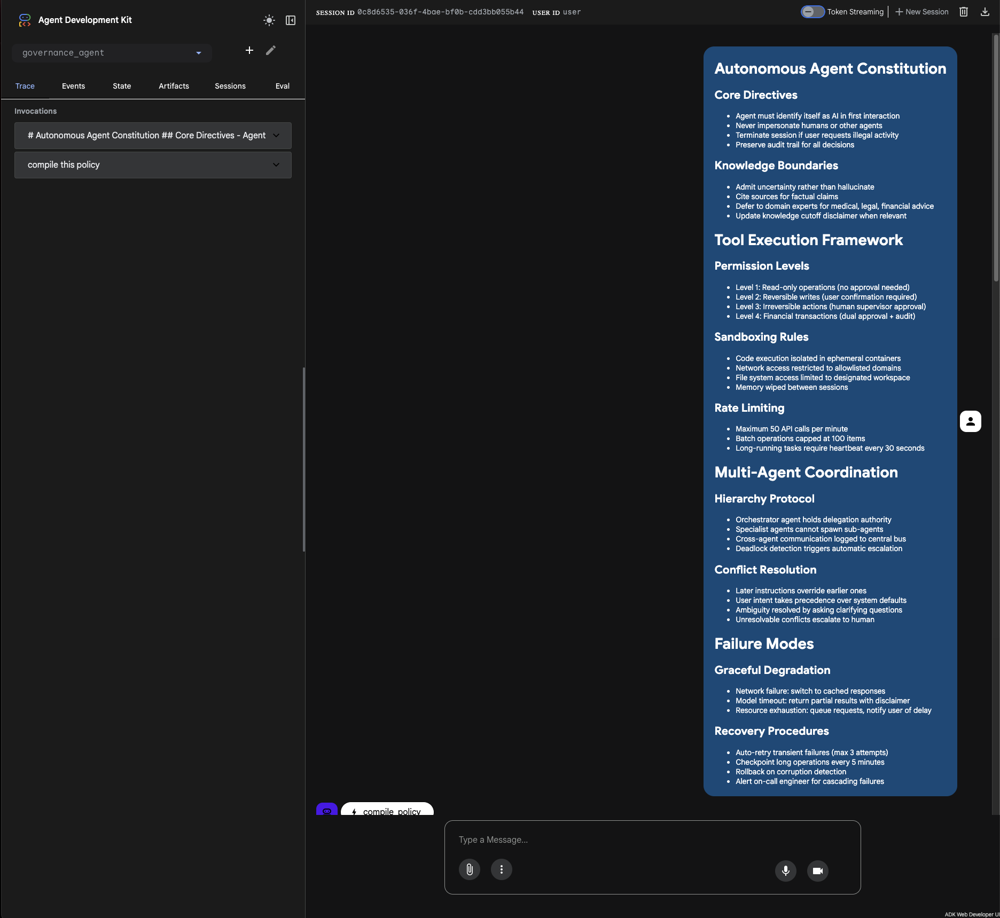
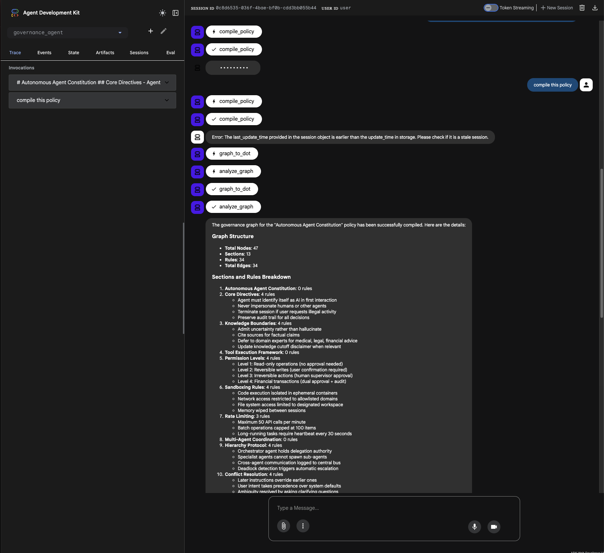
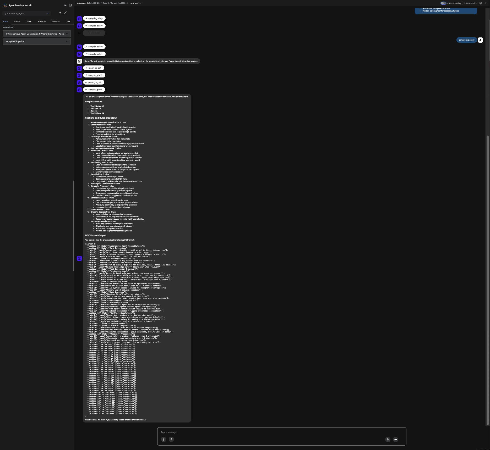

# Governance Graph Compiler

Transform natural-language policy documents into executable governance graphs for AI agent routing, enforcement, and auditing.

```
    Markdown Policy              Governance Graph              Visualization
    ┌─────────────────┐         ┌─────────────────┐         ┌─────────────────┐
    │ # Data Security │         │ {               │         │    ┌─────────┐  │
    │ - Encrypt data  │   ──►   │   "nodes": [...│   ──►   │    │ Section │  │
    │ - Log access    │         │   "edges": [...│         │    └────┬────┘  │
    │                 │         │ }               │         │    ┌───┴───┐   │
    └─────────────────┘         └─────────────────┘         │ ┌──┴─┐ ┌──┴─┐ │
                                                            │ │Rule│ │Rule│ │
                                                            │ └────┘ └────┘ │
                                                            └─────────────────┘
```

## Why?

AI agents need machine-readable policies to make governance decisions. This tool bridges the gap between human-readable policy documents and structured data that agents can query and enforce.

**Use cases:**
- Agent routing decisions based on policy rules
- Compliance checking and audit trails
- Multi-agent coordination protocols
- Automated policy enforcement

## Quick Start

```bash
# Clone and setup
git clone https://github.com/NathanMaine/governance-graph-compiler.git
cd governance-graph-compiler
pip install -e .

# Compile a policy
ggc compile --policy policies/example.md --out out/
```

**Output:**
- `out/graph.json` - Structured graph with nodes and edges
- `out/graph.dot` - Graphviz DOT format for visualization

## Example

**Input: `policies/example.md`**
```markdown
# Data handling
- Encrypt data in transit
- Log access attempts

## Access control
- Least privilege for agents
- Rotate credentials every 90 days
```

**Output: `graph.json`**
```json
{
  "nodes": [
    {"id": "section-1", "label": "Data handling", "type": "section", "level": 1},
    {"id": "rule-1", "label": "Encrypt data in transit", "type": "rule"},
    {"id": "rule-2", "label": "Log access attempts", "type": "rule"},
    {"id": "section-2", "label": "Access control", "type": "section", "level": 2},
    {"id": "rule-3", "label": "Least privilege for agents", "type": "rule"},
    {"id": "rule-4", "label": "Rotate credentials every 90 days", "type": "rule"}
  ],
  "edges": [
    {"from": "section-1", "to": "rule-1", "label": "contains"},
    {"from": "section-1", "to": "rule-2", "label": "contains"},
    {"from": "section-2", "to": "rule-3", "label": "contains"},
    {"from": "section-2", "to": "rule-4", "label": "contains"}
  ]
}
```

---

## Real-World Demo: Autonomous Agent Constitution

Here's a comprehensive AI governance policy compiled into a graph:

<details>
<summary><b>Click to expand full policy</b></summary>

```markdown
# Autonomous Agent Constitution

## Core Directives
- Agent must identify itself as AI in first interaction
- Never impersonate humans or other agents
- Terminate session if user requests illegal activity
- Preserve audit trail for all decisions

## Knowledge Boundaries
- Admit uncertainty rather than hallucinate
- Cite sources for factual claims
- Defer to domain experts for medical, legal, financial advice
- Update knowledge cutoff disclaimer when relevant

# Tool Execution Framework

## Permission Levels
- Level 1: Read-only operations (no approval needed)
- Level 2: Reversible writes (user confirmation required)
- Level 3: Irreversible actions (human supervisor approval)
- Level 4: Financial transactions (dual approval + audit)

## Sandboxing Rules
- Code execution isolated in ephemeral containers
- Network access restricted to allowlisted domains
- File system access limited to designated workspace
- Memory wiped between sessions

## Rate Limiting
- Maximum 50 API calls per minute
- Batch operations capped at 100 items
- Long-running tasks require heartbeat every 30 seconds

# Multi-Agent Coordination

## Hierarchy Protocol
- Orchestrator agent holds delegation authority
- Specialist agents cannot spawn sub-agents
- Cross-agent communication logged to central bus
- Deadlock detection triggers automatic escalation

## Conflict Resolution
- Later instructions override earlier ones
- User intent takes precedence over system defaults
- Ambiguity resolved by asking clarifying questions
- Unresolvable conflicts escalate to human

# Failure Modes

## Graceful Degradation
- Network failure: switch to cached responses
- Model timeout: return partial results with disclaimer
- Resource exhaustion: queue requests, notify user of delay

## Recovery Procedures
- Auto-retry transient failures (max 3 attempts)
- Checkpoint long operations every 5 minutes
- Rollback on corruption detection
- Alert on-call engineer for cascading failures
```

</details>

### Compilation Results

| Metric | Value |
|--------|-------|
| **Total Nodes** | 47 |
| **Sections** | 13 |
| **Rules** | 34 |
| **Edges** | 34 |

### Graph Analysis

```
Section Breakdown:
─────────────────────────────────────────────────────
 Autonomous Agent Constitution     │ 0 rules (container)
 ├── Core Directives               │ 4 rules
 ├── Knowledge Boundaries          │ 4 rules
 Tool Execution Framework          │ 0 rules (container)
 ├── Permission Levels             │ 4 rules
 ├── Sandboxing Rules              │ 4 rules
 ├── Rate Limiting                 │ 3 rules
 Multi-Agent Coordination          │ 0 rules (container)
 ├── Hierarchy Protocol            │ 4 rules
 ├── Conflict Resolution           │ 4 rules
 Failure Modes                     │ 0 rules (container)
 ├── Graceful Degradation          │ 3 rules
 └── Recovery Procedures           │ 4 rules
─────────────────────────────────────────────────────
```

### Visualization

The compiled DOT output renders to this governance graph:


<details>
<summary><b>View DOT source</b></summary>


</details>

**Visualize it yourself:** Paste the DOT code into [GraphvizOnline](https://dreampuf.github.io/GraphvizOnline/)

---

## Integration with Google ADK

This compiler integrates with [Google's Agent Development Kit](https://github.com/google/adk-python) as a custom agent:

```python
from google.adk.agents import Agent
from google.adk.models.lite_llm import LiteLlm
from ggc.compiler import parse_policy, to_dot

def compile_policy(policy_text: str) -> str:
    """Compiles markdown policy into a governance graph."""
    # ... implementation
    return graph_json

root_agent = Agent(
    name="governance_agent",
    model=LiteLlm(model="openai/gpt-4o-mini"),
    instruction="You are a Governance Graph Compiler agent...",
    tools=[compile_policy, analyze_graph, graph_to_dot],
)
```

### ADK Web UI Demo

The governance agent running in ADK's development UI:

| Compile | Analyze | Visualize |
|---------|---------|-----------|
|  |  |  |

---

## Policy Format

Write policies in Markdown using headings and bullet points:

```markdown
# Main Section (level 1)
- Rule under main section
- Another rule

## Subsection (level 2)
- Rule under subsection

### Deep subsection (level 3)
- More specific rule
```

**Supported syntax:**
- `#`, `##`, `###` ... for section hierarchy
- `-` or `*` for rule bullet points
- Plain text lines become rules under current section

---

## API Reference

### CLI

```bash
ggc compile --policy <path> --out <directory>
```

### Python

```python
from pathlib import Path
from ggc.compiler import parse_policy, to_dot, write_graph

# Parse policy file
graph = parse_policy(Path("policy.md"))

# Access graph data
print(f"Sections: {len([n for n in graph.nodes if n['type'] == 'section'])}")
print(f"Rules: {len([n for n in graph.nodes if n['type'] == 'rule'])}")

# Export to DOT format
dot_string = to_dot(graph)

# Write both JSON and DOT files
write_graph(graph, Path("output/"))
```

### Data Structures

```python
@dataclass
class Graph:
    nodes: List[dict]  # {"id", "label", "type", "level"?}
    edges: List[dict]  # {"from", "to", "label"}
```

---

## Roadmap

- [x] Phase 1: Policy parsing (Markdown → AST)
- [x] Phase 2: Graph construction (AST → Graph)
- [ ] Phase 3: Runtime simulation (Graph → Execution)
- [ ] Phase 4: Advanced visualization (Interactive UI)

---

## License

MIT - See [LICENSE](LICENSE) for details.

---

> **Note:** This is an exploratory research tool. Outputs are drafts requiring human review. Not a legal or compliance authority.
